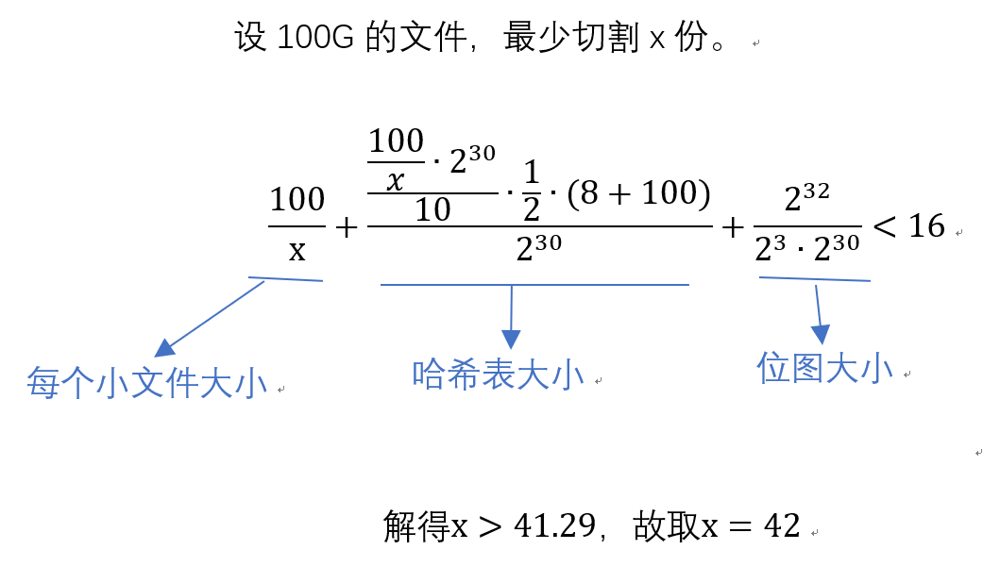

# SingleProcessingOfLargeFile

## 问题

有一个`100GB`的文件，里面内容是文本

要求：

- 找出第一个不重复的词

- 只允许扫一遍原文件

- 尽量少的`IO`

- 内存限制`16G`

- 随机字符串，每行一个字符串，长度范围为`1-100`

提示：

- 注意代码风格与规范，添加必要的测试、注释和文档

- 注意各类边界情况和异常处理，尝试优化性能

## 思路

1. 尽量的少的`I/O`，。对于每个词，最后有两个字节的换行符。每个长度范围为`1-100`字节的词，共有`2`的`800`次方种组合。选用`int64`表示每个词出现的位置，因为对于`100G`的文件有`2^31 - 1 < 100 * 2^30 / 3 < 2^63 - 1 `，其中`3`表示最小字符串长度`1`加上`2`字节的换行符。整个内存除了存放小文件外，还存放一张位图和哈希表。分割份数如下：

2. 维护`bitmap`。使用布隆过滤器的思想，构建一组哈希函数，对于每一个词，逐次使用哈希函数组的哈希函数计算出哈希值，接着在位图的相应比特位置置`1`。每次查询一个词是否重复时，也是逐次使用哈希函数组的哈希函数计算出哈希值，接着查看在位图的相应比特位置有`0`，如果有则该词一定未重复，把该词及其位置信息放入哈希表中；而如果在位图的相应比特位置都为`1`，则该元素有可能重复，此时进行维护哈希表，比如哈希表不存在此元素则加入，否则删除重复的元素。这种查找效率比较高，缺点是可能会哈希冲突。根据布隆过滤器原理可通过使用足够大的位图和一定数量的哈希函数来降低错误率。

3. 维护`hashmap`。在扫描词时，只统计词在大文件中的位置信息，并且哈希表的词数量控制在一个小文件的最大字符串数量的一半，当超过一般时就把下标最久出现的词删除，再放入哈希表。

4. 最后扫描`hashmap`中的候选键，选择最早出现的词并返回。如果哈希表为空，则不存在不重复的词。

## 其他

- `bitmap.go`文件存放的是位图数据结构的源码

- `handleFile.go`文件的源码是主要代码

- `util.go`文件是一组哈希函数用于计算哈希值

- `main.go`是主程序的入口

- `main_test.go`用于生成测试用的`100G`文件

